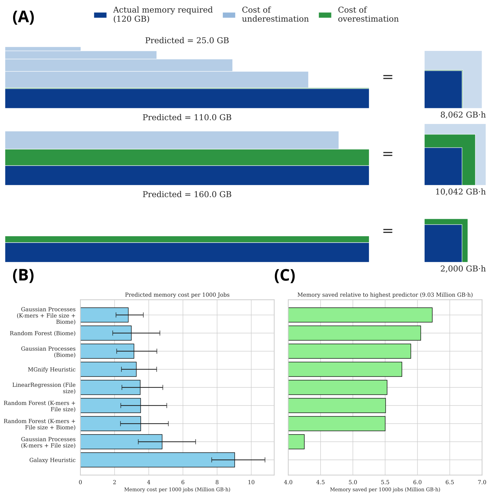

# Metaspades memory prediction
## Framework to predict memory requirement for metaspades using kmer statistics, biome, and input file size 

**Resource-aware memory allocation for metagenome assembly.**  
(A) Schematic illustration of the job retry policy implemented in Galaxy and MGnify for a task requiring 120 GB of memory. Three initial allocation scenarios (25, 110, and 160 GB) are shown, highlighting the trade-off between underestimation (light blue) and overestimation (green). In some cases, over-allocation reduces total resource consumption by avoiding repeated job failures.  
(B) Predicted memory requirements from different pipeline heuristics and machine learning models based on sample-derived features.  
(C) Relative memory savings achieved by each model and heuristic compared to the default Galaxy memory allocation strategy.

## Workflow to generate the results

1. **Get memory vs ID file from EBI**

   * File: [mgnify_assemblies_stats](input/mgnify_assemblies_stats.csv)

2. **Add SRR ID and subset samples**

   * Notebook: [add_SSR_to_assembly_stats.ipynb](add_SSR_to_assembly_stats.ipynb)

3. **Upload SRR ID file to Galaxy**

   * Example History: [Galaxy History](https://usegalaxy.eu/u/paulzierep/h/kmer-counting-subset-3-15-3-metaspades-v2)

4. **Run SRR to kmer workflow**

   * Workflow: [srr-to-kmer-statistics](https://usegalaxy.eu/u/paulzierep/w/srr-to-kmer-statistics)
   * K-mer size: 10

5. **Download kmer statistics**

   * Label: `kmer-stats`
   * Example file: [updated_mgnify_assemblies_stats_v3.15.3_metaspades_kmer10_stats.csv](output/updated_mgnify_assemblies_stats_v3.15.3_metaspades_kmer10_stats.csv)

6. **Add file size to kmer stats**

   * Notebook: [add_file_size_to_kmer_stats.ipynb](add_file_size_to_kmer_stats.ipynb)

7. **Run evaluation notebook**

   * Notebook: [evaluation_metrics.ipynb](evaluation_metrics.ipynb)

